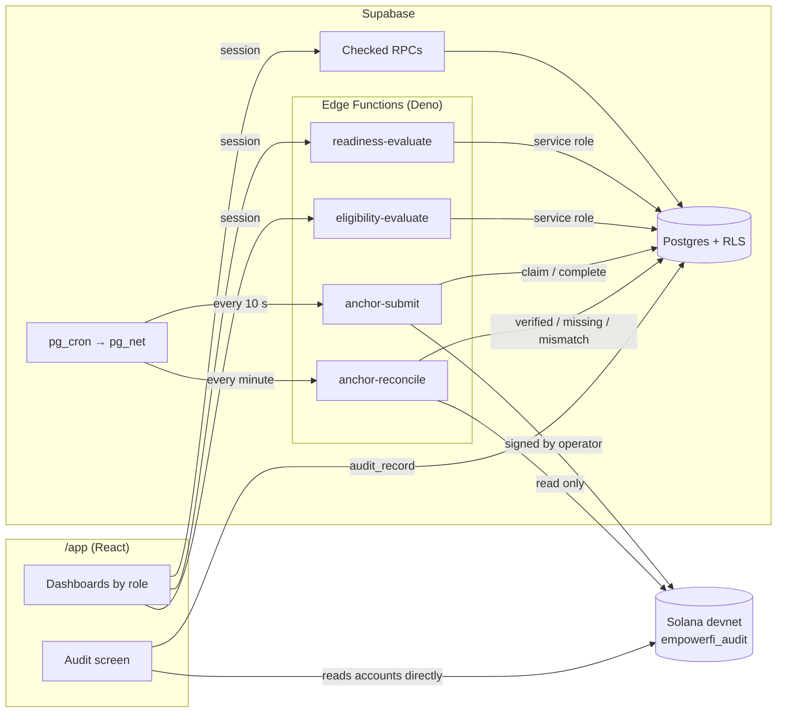

# Architecture

EmpowerFI prepares women micro-entrepreneurs for credit before anyone asks for it, qualifies the ones who do ask, and hands a partner a documented opportunity. The lending decision stays with the partner. Every step is recorded in a database and proven on Solana. This document shows how the pieces fit together. [PRIVACY.md](PRIVACY.md) covers what each role can see and what the chain can never see.

## The boundary

| Layer | Holds | Why there |
|---|---|---|
| **PostgreSQL** (Supabase) | Every record: people, communities, check-ins, assessments, opportunities, loans, payments, outcomes, costs | The system of record. Row-level security decides who reads what, and only checked functions can write. |
| **Solana** (program `empowerfi_audit`) | One 32-byte commitment per fact, plus lifecycle state: statuses, sequence numbers, times | A public, append-only proof that a record existed in this form, at this time, in this order. No personal or financial value ever goes on chain. |
| **Engines** (TypeScript, pure) | Readiness and eligibility rules, versioned | The same code runs on the server that decides and in the browser that audits. |

Solana is the audit layer and the future rail for capital. It isn't the database, and the product doesn't rely on blockchain being cheaper (see [Capital routes](#capital-routes)).



## The funnel spine

The product is one chain of facts. Each fact is written by a database function that checks who is acting, and each is queued for the chain behind the fact it depends on.

| Step | Record | Written by | Proof on chain |
|---|---|---|---|
| A community is created, then verified by EmpowerFI | `communities` | `create_community`, `verify_community` (admin; never one's own) | `CommunityAudit` (registration, then verification) |
| A participant is enrolled | `entrepreneurs`, `community_memberships` | `enroll_entrepreneur` (the community's leader) | `BorrowerAudit`, keyed by the hash of a random `borrower_ref` |
| She learns | `education_progress` | leader or herself | — (counted in cost to serve) |
| She reports a month | `checkins` | `submit_checkin` (herself or her leader) | `CheckinCommitment` per month |
| Readiness is assessed | `readiness_assessments` | `readiness-evaluate` → engine → `record_readiness_assessment` | `ReadinessAttestation` (status and band public; detail committed) |
| She asks for capital, if she wants to | `credit_intents` | `declare_credit_intent` (only herself) | — |
| Eligibility for that request | `eligibility_assessments` | `eligibility-evaluate` → engine → `record_eligibility_assessment` | `EligibilityAttestation`, which on chain requires her own CreditReady attestation |
| A qualified opportunity, referred to a matching partner | `qualified_credit_opportunities` | the same function; flagged ones wait for `refer_opportunity` (admin) | `OpportunityCommitment`, which requires an eligibility that isn't NotEligible |
| The partner decides | `partner_decisions`, `loans` | `partner_decide`, which only the partner's own users can call | `LoanAccount` (terms) |
| The loan moves | `loan_events` | `transition_loan` (the partner) | `LoanAccount` status, following the same state machine on chain |
| Instalments are paid | `payments` | `record_payment` (the partner) | `PaymentCommitment` per instalment |
| What changed in the business | `productive_outcomes` | `measure_outcome` (EmpowerFI or the partner) | `OutcomeCommitment` |

Three invariants are the thesis. Each is enforced in code and pinned by a test:

1. **Being ready and not asking is a complete outcome.** Eligibility runs only for participants who are ready *and* asked (`private.credit_pipeline()`), and `eligibility_inputs` refuses anyone else. Jaqueline in the demo is ready and is never pushed.
2. **Readiness ≠ eligibility ≠ approval.** These are three records written by three functions. EmpowerFI never makes the lending decision; not even an admin can call `partner_decide`.
3. **The chain is only proof.** Each proof is a domain-separated SHA-256 of the record, and the record stays in the database.

## Engines

`packages/readiness-engine` (`readiness-v0.1.0`) and `packages/eligibility-engine` (`eligibility-v0.1.0`) are pure, deterministic functions that use integers only:

- **Readiness** takes check-ins, education and community verification. It returns a status (`CREDIT_READY`, `NEEDS_MORE_DATA`, `NEEDS_PREPARATION` or `MANUAL_REVIEW`), a band, a score, and `missing_requirements[]` in words she can act on. It never uses engagement data (opens, clicks, time in the app).
- **Eligibility** takes one request against that readiness. It sizes an instalment the business can carry, proposes a smaller amount if needed, grades risk and confidence, and decides `ELIGIBLE`, `ELIGIBLE_REDUCED`, `MANUAL_REVIEW` or `NOT_ELIGIBLE`.

Each engine has scenario vectors with hand-reasoned expectations (13 and 9). They run in Vitest and in Deno. The Edge Functions use byte-identical copies in `platform/supabase/functions/_shared/`, and a test fails if a copy drifts from its source. The audit screen re-runs the engine on the stored inputs and checks that it gets the same result.

Outcome measurement (`outcome-v0.1.0`) is a SQL function. It compares the three months a business reported before its loan's month with the months after:

- **Incremental profit** = the change in average monthly result × the months after.
- **EVC** = incremental profit − interest paid.
- **EVM** = EVC ÷ principal.

This is an observation, not a claim that the loan caused the change, and every screen that shows it says so.

## Anchoring

`chain_anchors` is both the record of every proof and the work queue.

```
RPC writes a fact  →  chain_anchors row (pending, depends_on the fact before it)
pg_cron, every 10s →  private.dispatch_anchor_jobs(), only if a job is due and no run holds the lease
                   →  pg_net POST anchor-submit  (shared secret, from Vault)
anchor-submit      →  claim → commitment from anchor_payload() → look before write → send
                   →  confirm the batch together → complete_anchor_job | fail_anchor_job (backoff)
```

- **Commitment:** `SHA-256(utf8(domain) ‖ 0x00 ‖ utf8(canonicalJson(payload)))`. Canonical JSON means sorted keys, safe integers only, and no undefined values. `packages/audit-commitments` is the single implementation, pinned by golden vectors from an independent Python implementation in both Node and Deno.
- **Ordering:** `depends_on` makes verification wait for registration, enrollment for verification, eligibility for readiness, and so on down to outcomes. A job is claimable only once its dependency has confirmed, and the program would refuse it otherwise anyway.
- **Idempotency:** before sending, the function reads the target account. If it holds the same commitment, a previous run confirmed it and the signature is recovered. A different commitment is a permanent failure for a person to look at.
- **Throughput:** one worker at a time (a lease in `private.anchor_worker`). Each batch is sent whole, then confirmed with a single status query. A blockhash is reused for 20 s, and a 429 stops the run and hands back untouched jobs. Through a Helius devnet RPC, a full seed of 806 proofs confirmed in 11 minutes, all on the first attempt.

**Reconciliation** (`anchor-reconcile`, every minute while anything is due) re-checks each confirmed proof once a day. It recomputes the commitment from the record as it stands *now* and compares that with the stored commitment and the on-chain account. The result is `verified`, `missing` or `mismatch`, with a note. Earlier loan status changes are checked in the transaction that made them. On the remote, a check-in edited by R$1 after it was proven was flagged within a minute.

## The program

`empowerfi_audit` at `4rqhxEwPiTd5CATztMfNmFfLaSntcmZPuzHKgmbESfRR` on devnet, Anchor 1.0. It is always upgraded in place, so every proof ever written stays under one program ID.

| Account | Seeds | Holds |
|---|---|---|
| `PlatformConfig` | `config` | upgrade authority, operator |
| `CommunityAudit` | `community`, community_ref | commitment, status, verification commitment |
| `BorrowerAudit` | `borrower`, hash(borrower_ref) | community, enrollment commitment |
| `CheckinCommitment` | `checkin`, borrower, YYYYMM | commitment |
| `ReadinessAttestation` | `readiness`, borrower, n | status, band, model version, commitment |
| `EligibilityAttestation` | `eligibility`, borrower, n | readiness, decision, risk band, confidence, model version, commitment |
| `OpportunityCommitment` | `opportunity`, borrower, n | eligibility, commitment |
| `LoanAccount` | `loan`, opportunity | status, terms commitment, last transition commitment, transitions |
| `PaymentCommitment` | `payment`, loan, instalment | commitment |
| `OutcomeCommitment` | `outcome`, loan, n | commitment |

It has 13 instructions, all signed by the operator key except `initialize_platform` and `set_operator`, which need the upgrade authority. `set_operator` means a leaked server key can be rotated without changing the program ID. The rules live on chain as well as in the database:

- eligibility needs the same borrower's CreditReady attestation;
- an opportunity needs a non-NotEligible eligibility;
- one loan per opportunity;
- the loan state machine (`Draft → PartnerApproved → Disbursed → Active → Paid | Defaulted`, cancellable only before disbursement);
- payments only on disbursed or active loans, one per instalment;
- outcomes only on loans that reached the business.

The program has 20 LiteSVM tests.

## The audit screen

`/app/audit/:kind/:id`, for anyone allowed to see that record, does the following in the browser:

1. Fetches the record through `audit_record` (which checks who is asking).
2. Recomputes the commitment.
3. Reads the account straight from devnet.
4. Checks that the commitment matches, that the program owns the account, and that its address matches the PDA derived independently.
5. Runs kind-specific checks: engine re-runs; the transition decoded from its transaction; a payment belonging to that loan; the outcome arithmetic redone.

Editing the record in the database turns the verdict to MISMATCH. The page also shows the last background reconciliation result.

## Cost to serve

Small tickets fail on operating cost, so cost is counted from a community's first day rather than from disbursement. Triggers write one `cost_events` row per fact at a pilot rate card (`cost_rates`: staff minutes at R$30/h plus fixed costs, and who bears them). Because triggers write the rows, no code path can forget to count. `cts_summary()` gives cost per participant, per ready participant, per opportunity, per loan and per R$100 lent. The capital view reports per loan and per R$1,000.

## Capital

A capital provider commits (simulated) capital to a lending partner. `capital_portfolio()` returns the book that capital funds:

- committed, deployed, available, received and outstanding amounts;
- repayment and PAR 30;
- risk mix;
- expected return net of expected loss, at pilot assumptions;
- cost to serve;
- outcomes in aggregate;
- audit coverage.

Loans appear under a code derived from the loan alone.

### Capital routes

`packages/capital-route` prices the same loan by route: a domestic partner and Pix, a BRL stablecoin, foreign capital by bank wire, and foreign capital by USD stablecoin. The price is the sum of the capital's required return, currency hedge, expected loss, cost to serve, rail spreads and fees, and compliance. The tests pin three conclusions:

- For capital already in reais, the domestic route wins.
- A stablecoin beats the bank wire it replaces only where capital crosses a border.
- The on-chain fee is negligible next to the hedge.

Every assumption is editable on the portfolio page, and no money moves.

## Demo data

`scripts/platform/seed-demo.mts` rebuilds the scenario deterministically in about 30 seconds:

- 4 verified communities and 100 participants, with education and 6–7 months of check-ins shaped by business profiles;
- readiness for everyone, requests from some of those who are ready, eligibility, and partner decisions taken through the partner's own session;
- a July cycle of six loans with repayment and outcomes.

The first-cycle facts are recorded through the live functions and then dated to when they happened. The seed holds the anchor worker's lease meanwhile, so their proofs carry those dates. Everything is marked `is_simulated`.

## Tests

| Suite | Count | Covers |
|---|---|---|
| pgTAP (`platform/supabase/tests`) | 191 | RLS and RPC rules per role, the thesis, the pipeline and reconciliation queue, cost to serve, capital, outcomes, and structural rules checked from the catalog. Runs locally and against the remote in a rolled-back transaction. |
| LiteSVM (`programs/empowerfi-audit/tests`) | 20 | every instruction's rules and state machine |
| Vitest | 92 | engines, commitments, the IDL privacy review, capital routes, UI helpers |
| Deno | 38 | the vendored engines and commitments, against the same vectors |
| Devnet scan (`scripts/platform/scan-chain-pii.mts`) | every account | reviewed types only, and none of the database's names, e-mails or amounts |

## Repository map

```
src/app/                     the platform (/app): pages by role, audit screen, components
src/                         the public site (PT-BR / EN)
packages/readiness-engine    readiness rules + vectors
packages/eligibility-engine  eligibility rules + vectors
packages/audit-commitments   canonical JSON, domains, commitments + golden vectors
packages/audit-client        Codama-generated client for the program, IDL, privacy test
packages/capital-route       capital route pricing
programs/empowerfi-audit     the Anchor program + LiteSVM tests
platform/supabase            migrations, pgTAP tests, Edge Functions (see platform/README.md)
scripts/platform             demo accounts, demo scenario, zero-PII scan
```
