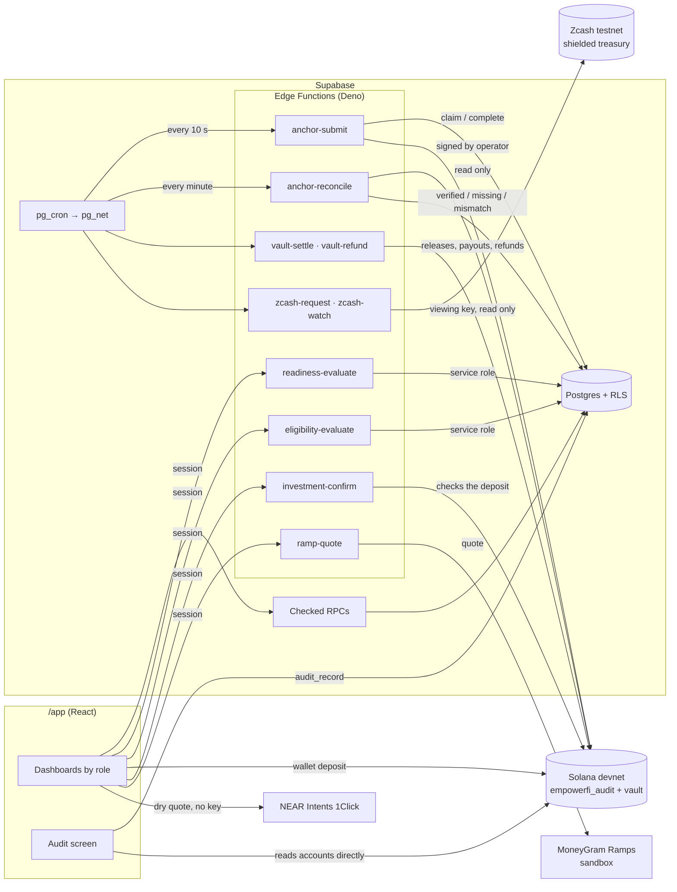

# Architecture

EmpowerFI prepares women micro-entrepreneurs for credit before anyone asks for it, qualifies the ones who do ask, and funds them through P2P capital: a Capital Allocation Engine chooses between a domestic pool in reais and a global pool in USDC on Solana, and EmpowerFI's P2P desk formalises and services the loan. It is a prototype of a future regulated P2P architecture, not a licensed lender. Every step is recorded in a database and proven on Solana. This document shows how the pieces fit together. [PRIVACY.md](PRIVACY.md) covers what each role can see and what the chain can never see.

## The boundary

| Layer | Holds | Why there |
|---|---|---|
| **PostgreSQL** (Supabase) | Every record: people, communities, check-ins, assessments, opportunities, loans, payments, outcomes, costs | The system of record. Row-level security decides who reads what, and only checked functions can write. |
| **Solana** (program `empowerfi_audit`) | One 32-byte commitment per fact, plus lifecycle state: statuses, sequence numbers, times | A public, append-only proof that a record existed in this form, at this time, in this order. No personal or financial value ever goes on chain. |
| **Engines** (TypeScript, pure) | Readiness and eligibility rules, versioned | The same code runs on the server that decides and in the browser that audits. |

Solana is the verifiability layer and the global capital rail; Pix is the local last mile. It isn't the database, and the product doesn't rely on blockchain being cheaper (see [Capital pools](#capital-pools-and-the-allocation-engine)).



## The funnel spine

The product is one chain of facts. Each fact is written by a database function that checks who is acting, and each is queued for the chain behind the fact it depends on.

| Step | Record | Written by | Proof on chain |
|---|---|---|---|
| A community is created, then verified by EmpowerFI | `communities` | `create_community`, `verify_community` (admin; never one's own) | `CommunityAudit` (registration, then verification) |
| A participant is enrolled | `entrepreneurs`, `community_memberships` | `enroll_entrepreneur` (the community's leader) | `BorrowerAudit`, keyed by the hash of a random `borrower_ref` |
| She learns | `education_progress` | leader or herself | — (counted in cost to serve) |
| She reports a month | `checkins` | `submit_checkin` (herself or her leader) | `CheckinCommitment` per month |
| Readiness is assessed | `readiness_assessments` | `readiness-evaluate` → engine → `record_readiness_assessment` | `ReadinessAttestation` (status and band public; detail committed) |
| She asks for capital, if she wants to | `credit_intents` | `declare_credit_intent` (only herself) | — |
| Eligibility for that request | `eligibility_assessments` | `eligibility-evaluate` → engine → `record_eligibility_assessment` | `EligibilityAttestation`, which on chain requires her own CreditReady attestation |
| A qualified opportunity, given a pool by the Capital Allocation Engine | `qualified_credit_opportunities` (`funding_pool`, `allocation_reason_codes`) | the same function; the pool is chosen as it opens to investors (`private.open_for_funding`); flagged ones wait for `refer_opportunity` (admin) | `OpportunityCommitment`, which requires an eligibility that isn't NotEligible |
| Investors fund it | `investments` | `investment-confirm` (global, a wallet deposit), `allocate_domestic` (domestic, simulated reais) | `AllocationCommitment` |
| Funded, it is formalised | `partner_decisions`, `loans` | `formalise_loan` (EmpowerFI's P2P desk), at the engine's rate; the desk may decline instead, and investors are refunded | `LoanAccount` (terms) |
| The loan moves | `loan_events` | `transition_loan` (the desk) | `LoanAccount` status, following the same state machine on chain |
| On disbursement of a global loan, how the dollars become her reais | `settlement_quotes` (both routes), `settlement_decisions`, `settlement_legs.route` | `private.settle_on_disbursal` → `private.record_settlement_route` | `SettlementRouteCommitment`, queued behind the disbursement's own transition: the route is public, both quotes and the reasons are in the commitment ([Settlement routing](#settlement-routing)) |
| Instalments are paid | `payments` | `record_payment` (the desk) | `PaymentCommitment` per instalment |
| What changed in the business | `productive_outcomes` | `measure_outcome` (EmpowerFI) | `OutcomeCommitment` |

Three invariants are the thesis. Each is enforced in code and pinned by a test:

1. **Being ready and not asking is a complete outcome.** Eligibility runs only for participants who are ready *and* asked (`private.credit_pipeline()`), and `eligibility_inputs` refuses anyone else. Jaqueline in the demo is ready and is never pushed.
2. **Readiness ≠ eligibility ≠ funding.** These are separate records written by separate functions. Eligibility sizes what the business can carry; the allocation engine only chooses where the capital comes from; a loan exists only once investors have funded it.
3. **The chain is only proof.** Each proof is a domain-separated SHA-256 of the record, and the record stays in the database.

## Engines

`packages/readiness-engine` (`readiness-v0.1.0`) and `packages/eligibility-engine` (`eligibility-v0.1.0`) are pure, deterministic functions that use integers only:

- **Readiness** takes check-ins, education and community verification. It returns a status (`CREDIT_READY`, `NEEDS_MORE_DATA`, `NEEDS_PREPARATION` or `MANUAL_REVIEW`), a band, a score, and `missing_requirements[]` in words she can act on. It never uses engagement data (opens, clicks, time in the app).
- **Eligibility** takes one request against that readiness. It sizes an instalment the business can carry, proposes a smaller amount if needed, grades risk and confidence, and decides `ELIGIBLE`, `ELIGIBLE_REDUCED`, `MANUAL_REVIEW` or `NOT_ELIGIBLE`.

Each engine has scenario vectors with hand-reasoned expectations (13 and 9). They run in Vitest and in Deno. The Edge Functions use byte-identical copies in `platform/supabase/functions/_shared/`, and a test fails if a copy drifts from its source. The audit screen re-runs the engine on the stored inputs and checks that it gets the same result.

Outcome measurement (`outcome-v0.1.0`) is a SQL function. It compares the three months a business reported before its loan's month with the months after:

- **Incremental profit** = the change in average monthly result × the months after.
- **EVC** = incremental profit − interest paid.
- **EVM** = EVC ÷ principal.

This is an observation, not a claim that the loan caused the change, and every screen that shows it says so.

## Anchoring

`chain_anchors` is both the record of every proof and the work queue.

```
RPC writes a fact  →  chain_anchors row (pending, depends_on the fact before it)
pg_cron, every 10s →  private.dispatch_anchor_jobs(), only if a job is due and no run holds the lease
                   →  pg_net POST anchor-submit  (shared secret, from Vault)
anchor-submit      →  claim → commitment from anchor_payload() → look before write → send
                   →  confirm the batch together → complete_anchor_job | fail_anchor_job (backoff)
```

- **Commitment:** `SHA-256(utf8(domain) ‖ 0x00 ‖ utf8(canonicalJson(payload)))`. Canonical JSON means sorted keys, safe integers only, and no undefined values. `packages/audit-commitments` is the single implementation, pinned by golden vectors from an independent Python implementation in both Node and Deno.
- **Ordering:** `depends_on` makes verification wait for registration, enrollment for verification, eligibility for readiness, and so on down to outcomes. A job is claimable only once its dependency has confirmed, and the program would refuse it otherwise anyway.
- **Idempotency:** before sending, the function reads the target account. If it holds the same commitment, a previous run confirmed it and the signature is recovered. A different commitment is a permanent failure for a person to look at.
- **Throughput:** one worker at a time (a lease in `private.anchor_worker`). Each batch is sent whole, then confirmed with a single status query. A blockhash is reused for 20 s, and a 429 stops the run and hands back untouched jobs. Through a Helius devnet RPC, a full seed of 806 proofs confirmed in 11 minutes, all on the first attempt.

**Reconciliation** (`anchor-reconcile`, every minute while anything is due) re-checks each confirmed proof once a day. It recomputes the commitment from the record as it stands *now* and compares that with the stored commitment and the on-chain account. The result is `verified`, `missing` or `mismatch`, with a note. Earlier loan status changes are checked in the transaction that made them. On the remote, a check-in edited by R$1 after it was proven was flagged within a minute.

## The program

`empowerfi_audit` at `4rqhxEwPiTd5CATztMfNmFfLaSntcmZPuzHKgmbESfRR` on devnet, Anchor 1.0. It is always upgraded in place, so every proof ever written stays under one program ID.

| Account | Seeds | Holds |
|---|---|---|
| `PlatformConfig` | `config` | upgrade authority, operator |
| `CommunityAudit` | `community`, community_ref | commitment, status, verification commitment |
| `BorrowerAudit` | `borrower`, hash(borrower_ref) | community, enrollment commitment |
| `CheckinCommitment` | `checkin`, borrower, YYYYMM | commitment |
| `ReadinessAttestation` | `readiness`, borrower, n | status, band, model version, commitment |
| `EligibilityAttestation` | `eligibility`, borrower, n | readiness, decision, risk band, confidence, model version, commitment |
| `OpportunityCommitment` | `opportunity`, borrower, n | eligibility, commitment |
| `LoanAccount` | `loan`, opportunity | status, terms commitment, last transition commitment, transitions |
| `PaymentCommitment` | `payment`, loan, instalment | commitment |
| `SettlementRouteCommitment` | `settlement_route`, loan | selected route, commitment over the whole decision |
| `AllocationCommitment` | `allocation`, random ref | commitment (which investment funds which opportunity stays in the database) |
| `OutcomeCommitment` | `outcome`, loan, n | commitment |
| `ConsentCommitment` | `consent`, borrower, n | commitment of the uses she allowed |

It has 17 instructions, all signed by the operator key except `initialize_platform` and `set_operator`, which need the upgrade authority. `vault_transfer` is the only one that moves value: USDC out of the program's vault, for a refund, a release to the off-ramp or an investor's payout, with no borrower, opportunity or allocation account attached. `set_operator` means a leaked server key can be rotated without changing the program ID. The rules live on chain as well as in the database:

- eligibility needs the same borrower's CreditReady attestation;
- an opportunity needs a non-NotEligible eligibility;
- one loan per opportunity;
- the loan state machine (`Draft → PartnerApproved → Disbursed → Active → Paid | Defaulted`, cancellable only before disbursement);
- payments only on disbursed or active loans, one per instalment;
- outcomes only on loans that reached the business;
- a settlement route only on a loan that has been disbursed, and only once.

The program has 28 LiteSVM tests.

## The audit screen

`/app/audit/:kind/:id`, for anyone allowed to see that record, does the following in the browser:

1. Fetches the record through `audit_record` (which checks who is asking).
2. Recomputes the commitment.
3. Reads the account straight from devnet.
4. Checks that the commitment matches, that the program owns the account, and that its address matches the PDA derived independently.
5. Runs kind-specific checks: engine re-runs; the transition decoded from its transaction; a payment belonging to that loan; the outcome arithmetic redone.

Editing the record in the database turns the verdict to MISMATCH. The page also shows the last background reconciliation result.

## Money: investing, the vault and settlement

[PRIVACY.md](PRIVACY.md#investor-capital) covers what each movement reveals; this is how they run.

- **A global investment.** The investor signs in with a Solana wallet (Sign-In with Solana, through Supabase Auth) — from the login page or, without leaving it, from the opportunity she is reading, since the wallet sign-in replaces the demo session in place — and sends test USDC to the program's vault with a plain token transfer. `investment-confirm` reads the transaction from devnet, checks the amount, the vault and the sender, and records the allocation, which is queued as an `AllocationCommitment`.
- **With shielded ZEC.** `zcash-request` answers with a ZIP 321 payment request to EmpowerFI's shielded treasury on Zcash testnet, with a random memo reference. `zcash-watch` scans new blocks every minute with the treasury's viewing key (`services/zcash-watcher`, Rust compiled to WebAssembly) and, once a payment confirms, credits the vault with USDC for that allocation.
- **The crossing, priced.** What the ZEC leg is worth in either direction is quoted live by NEAR Intents' 1Click API from the browser (`src/app/lib/oneClick.ts`, `Crossing.tsx`) — the amount out, the floor the route commits to, and its time estimate. Every call is a dry quote: it returns no deposit address, so nothing here can move funds, and it needs no key, so a reader with no account sees the same prices. Three facts about that network are load-bearing enough to live in the file's header, because each one settled a design question. It has no testnet, so the price is mainnet and the movement beside it is this platform's own on Zcash testnet and Solana devnet, and each panel says which is which. A shielded recipient is refused — `u1…` answers `recipient is not valid`, only transparent `t1…` is accepted — so a swap lands ZEC in the open and the shielding is this treasury's step, which is why the shielding is the part worth having. And Solana is the one origin the network does not route into ZEC, while Ethereum, Base and Arbitrum USDC do, so the way in is from those three and the way out is to Solana. `scripts/verify-crossing.mts` asks all four directions before it reads a screen: the claim is a fact about their network, not about this code, and if it changes the screens need rewriting rather than patching.
- **A domestic allocation.** `allocate_domestic` records a simulated position in reais; nothing moves on chain but its proof.
- **Settlement.** When the desk disburses, the database creates settlement legs; `vault-settle` sends the real ones (the release of global capital to the off-ramp's account, then each instalment's shares paid out to investors) and marks the rest as simulated: the conversion to reais at the demo quote, and Pix both ways. `ramp-quote` asks MoneyGram Ramps' sandbox what a USDC cash-out to Brazil would cost, to show beside the simulated conversion. On a global loan, the same moment prices both ways of turning the dollars into reais and records which one paid her: [Settlement routing](#settlement-routing).
- **Refunds.** If the desk declines a funded opportunity, or she withdraws consent before disbursement, `vault-refund` returns each wallet investor's USDC from the vault.

Every cron-driven function is dispatched by `pg_cron` through `pg_net` only when work is due, with the shared secret from Vault.

## The investor's asset

The borrower gets a loan; the investor gets something she can hold. When an opportunity reaches its target, a trigger opens one `credit_positions` row per investment — never earlier, so "a position cannot exist before funding" is a property of the schema rather than a check someone remembers to write — with her share in basis points, taken from the same arithmetic the portfolio already used.

`position-mint`, on the same cron pattern as settlement, turns each into a **Token-2022 mint**: supply one, zero decimals, operator as mint and freeze authority, and the `DefaultAccountState` extension set to *frozen*. The mint carries no metadata; the asset id `EF-CREDIT-####` stays in the database. Its key is derived from the operator's secret and the position's id, so a retry after a timeout builds the same address and the chain refuses the duplicate — a position can be claimed twice and still exist once.

The frozen default is what makes the control real. A token account for one of these assets is unusable the moment it is created, so an asset can only be held by a wallet the platform has thawed, and the list of admitted wallets (`eligible_wallets`) stops being a rule this app applies and becomes one the token program enforces. Transfer has three steps and only the first is ours: `position-transfer` admits the destination by creating and thawing its account, the investor signs the transfer in her own wallet, and the function then asks the chain what happened — destination holding one, source holding none — before writing the new owner down. EmpowerFI cannot move her asset; it can only decide where it may go.

A position is readable by whoever funded it **and** by whoever holds it, and the row says which of the two is reading. Before that, the console asked one question — did you buy this? — which is the wrong question the moment an asset can change hands: transfer one, and the chain says the destination holds it while the screen still lists it under the investor who funded it, and the wallet that actually holds it sees nothing. Either party may ask the platform to admit a destination, because admitting creates and thaws an account and moves nothing; only the key that holds the asset can sign it away.

Handing an asset on ends the claim and the reader refuses her afterwards, which is right: she is not party to that credit any more, and a console still showing her its balance would say otherwise. Losing the claim is not losing the record, though, so `position_history()` gives her what she held, when it reached her, when it left and to whom — frozen at the moment she handed it on, with nothing from the loan, which has carried on without her.

Nothing about this is a market. There is no exchange, order book, bid, price or depth, the screens say so in both languages, and the word *liquidez* is never used for these assets. [LEGAL_REVIEW.md](LEGAL_REVIEW.md) carries the questions counsel has to answer before any of it could be real.

## Cost to serve

Small tickets fail on operating cost, so cost is counted from a community's first day rather than from disbursement. Triggers write one `cost_events` row per fact at a pilot rate card (`cost_rates`: staff minutes at R$30/h plus fixed costs, and who bears them). Because triggers write the rows, no code path can forget to count. `cts_summary()` gives cost per participant, per ready participant, per opportunity, per loan and per R$100 lent. The capital view reports per loan and per R$1,000.

The card is versioned (`cost_rate_cards`: a version, the date it takes effect, and whether its numbers are `simulated` or `observed`). Every rate belongs to a card and every cost event is stamped with the card that priced it, chosen by the date of the *fact* — so the pilot's measured rates arrive as a new card and nothing already recorded changes. `cost_sensitivity()` answers the other question, what a larger ticket would do, and it never reads recorded amounts: costs are facts about work that happened, and moving the ticket does not change them. It runs over the card, using how often each stage has occurred as its multipliers (per participant for preparation, per loan for origination and servicing), and returns the ticket actually lent among its rows so the model can be held against the measurement.

For one opportunity, `opportunity_economics()` returns two numbers and never one: what was recorded for that entrepreneur (a fact out of `cost_events`), the same against her own ticket, and the programme's cost per R$ 100 lent beside it. Hers is always the smaller — it counts the one path that worked, while the programme's counts the funnel that produced it — so the engine run shows both and names the gap. `operating_economics_snapshots` freezes her costs as they stood when the opportunity opened for funding, with the card that priced them and the allocation engine's version; later events and later cards do not move it. An investor reads none of this.

### Who pays, and what the tool is sold for

A total that adds the three of them together answers nobody's question. EmpowerFI licenses a tool; the community does the fieldwork on a budget of its own; the desk lends from its own book. `cost_events` carried `borne_by` from the start, but a stage had one bearer, so the ten minutes a leader spends typing a participant's check-in were billed to the platform — R$ 2.465,00 of R$ 3.152,60, the largest line in EmpowerFI's cost, for work EmpowerFI does not do. A fact may now carry one event per bearer (`unique (stage, fact_id, borne_by)`), and `record_cost` takes the bearer of any extra minutes; the platform keeps the two centavos it really pays. `operating_economics()` reports `by_bearer` beside `by_phase`, and `by_stage` is grouped by who bore it rather than by what the card says.

The price is a card too. `pricing_cards` holds a billing model (`tool_licence` or `bundled`), a seat price per participant-month, a monthly floor, and the share passed through to the community when one package is sold — versioned and marked `simulated` or `observed` exactly like the cost card. One is seeded: R$ 20 per participant-month with a R$ 1,500 floor, benchmarked against Musoni's €3 per client and a median institution's US$ 106.7 per borrower a year. A bundled card was seeded beside it at R$ 100 and removed — that is the price of accompaniment rather than of software, and it showed the better margin only because its pass-through was priced at the leader's minutes on the cost card, which is the floor of a community budget and not a negotiated one. The shape stays in the schema and in every query that reads it: one package needs a community budget someone has agreed to, and then it is one row. `cost_rate_cards` gained the cost of merely existing — a fixed monthly block and the participants it carries — because a card that prices work per occurrence cannot see it. `business_model()` puts the two together: cost per participant-month, margin at the licence, how many participants across every programme pay for the fixed block, and what one programme carrying that block alone would cost. The last number is the one that matters early, and apportioning the block by seats hides it.

## The rate in reais

Everything priced in reais used to be priced at a fixed R$ 5.40, which made one claim of the settlement model untestable: the two routes differ in *where* the exchange rate is struck, and with a constant, striking it earlier changed nothing. `public.fx_rates` is now a time series of observed prices — USDC/BRL from Mercado Bitcoin (what USDC actually fetches in Brazil) and USD/BRL from the Banco Central's PTAX (the official reference) — filled by the `fx-quote` function every ten minutes. `private.brl_per_usdc_milli(at)` reads the freshest USDC/BRL at or before that instant, within half an hour, and falls back to the old constant when there is none; `public.fx_market()` tells the screens which of the two it used. Neither request carries an amount, a wallet or a person: both are public price endpoints.

## Stories, sponsors and mandates

The app tells one loop in two stories, numbered in the bar at the top of every page: **Impact Intelligence** (`/app/impact`) and the **Investor Console** (`/app/investor`). The **Credit & Capital Engine** (`/app/capital`) was a third until the engine stopped being a destination: `private.open_for_funding()` already runs the allocation engine in the database when an opportunity opens, so a page offering to run it first was a rehearsal of a decision already taken. Its area carries `hidden: true` in `stories.ts` — the routes still resolve, and every link into it comes from the money it decided: a sponsor drilling into a code, an opportunity, or a position. Operations sit beside them: the entrepreneur's journey, community operations, the P2P desk, admin and the audit console. `src/app/lib/stories.ts` maps each area to its routes, roles and demo persona; a demo account opens an area its role cannot by signing in as that persona, and drops everything the previous account had loaded.

- **Sponsors and programs.** `sponsors`, `programs` (period, funding committed and deployed) and `program_communities`; a `sponsor` role acts for one sponsor. `impact_intelligence(program)` reads the program over its communities from the same per-member state the community workspace reads (`private.community_state`):
  - hero figures and a cumulative funnel from sponsored to performing;
  - segments by readiness, data quality, credit intent, purpose, sector and geography, each group under five hidden;
  - capital mobilised by pool, repayment, and outcomes counted only with the impact consent;
  - the proofs behind the program by kind, and qualified opportunities by Q- code when she consented to be shown to investors.
  A sponsor also reads `capital_overview()` and its program's queue in `engine_opportunities()`, to drill into an opportunity.
- **Mandates.** `investor_mandates` holds an investor's type (individual or impact fund) and mandate: impact mandate, states, purposes, sectors, ticket range, risk bands and route, each empty list meaning any. `set_mandate()` is the investor's own; `src/app/lib/mandate.ts` matches it, in the browser, against what every investor already sees of an opportunity.
- **Outcomes during the demo.** The desk measures a loan's productive outcome from its loan page (`measure_outcome`, unchanged). The seed leaves one July loan unmeasured, with its months after, for that step.
- **View platform as.** Five views (spec §3A, 17 Sep) in `src/app/lib/views.ts`: program sponsor, investor or impact fund, credit and capital operator, community operator, entrepreneur. Each has a value line, a demo persona, and primary and secondary tools. The public entry (`/app/login?as=…`) and the signed-in landing (`/app/start?as=…`, where the header selector leads) show the chosen view's value and tools. A view never widens access: a view's tools are only routes its own role opens (a Vitest test checks this against the areas' roles), a demo account switches to the view's persona, and any other account sees only the views its role opens.
- **Operating economics.** `operating_economics(program?)` answers spec §2A's question, whether productive credit can become cheaper to operate without becoming weaker credit, from facts already recorded. It pairs what must improve with what must not be sacrificed:
  - cost to serve (from `cost_events`, all-in and credit-only per R$ 100 lent) with eligibility discipline (decisions and reason codes);
  - time to decision (median and p90 from intent, eligibility, opportunity, desk decision and disbursement timestamps) with affordability checks;
  - operational scalability (steps that took no one's time, staff hours) with continuous follow-up (reporting, open follow-ups, instalments, outcomes);
  - capital access (routes, waiting, allocation reasons) with portfolio quality (instalments on schedule, late, paid, defaulted).

  The desk, auditors and admins read it over everything, and a sponsor over its own program. The page `/app/capital/economics` labels it a hypothesis: costs come from the pilot's assumed rate card and the demo data is simulated.
- **Proofs beside events.** `VerifyButton` opens a proof drawer (`components/proof`) with the event, model version, commitment, devnet transaction and a check on Solana. When the viewer may read the record, it is recomputed in the browser by the same `lib/verify.ts` the audit page uses.

## Capital pools and the allocation engine

There are two routes, and only two (founder specification, 16 Sep):

| | Domestic P2P | Global P2P |
|---|---|---|
| Capital | Brazilian investors, a simulated BRL pool | International and impact investors, test USDC on Solana devnet |
| To her business | Pix, in reais | Program vault → one of two settlement routes (simulated; MoneyGram sandbox quote) → Pix. See [Settlement routing](#settlement-routing) |
| FX / hedge | none | an explicit assumption |

**A pool is declared capacity, not custody.** EmpowerFI holds no capital: `funding_pools.capital_*` is what each side of the market has said it will lend through this desk, and a pool's liquidity is that figure less what is already lent. It exists so the second engine can answer *waiting for capital* rather than assume there is always more — which is why one seeded case is a request no pool can fund. An investor's money moves when she funds one named opportunity, into the program's vault, and only between the allocation and the disbursement. Both pool figures are pilot assumptions and are flagged `is_simulated`.

`funding_pools` holds each pool's policy: capital, required return, risk appetite, ticket range, mandate, and for global the FX hedge and ramp cost. `packages/capital-allocation` is the engine, mirrored in SQL as `private.allocate_funding` and held to the same hand-reasoned vectors by Vitest and pgTAP:

1. Is domestic capital available and eligible for this opportunity?
2. Is global capital?
3. Among the pools that can take it, which costs her less a year — required return, expected loss, cost to serve, hedge and ramp? A tie goes domestic.

It answers with the pool, her rate and instalment, the investors' expected return, and reason codes (`DOMESTIC_LOWEST_COST`, `DOMESTIC_POOL_EXHAUSTED`, `GLOBAL_EXPANDS_CAPACITY`, `GLOBAL_IMPACT_MANDATE_MATCH`, `GLOBAL_FX_COST_DOMINATES`, `RISK_BAND_NOT_ELIGIBLE`, `TICKET_OUTSIDE_POOL_POLICY`, …). The pool is kept on the opportunity and never changes while investors hold positions in it. `capital_overview()` replays the engine over every opportunity not yet lent, to show qualified demand and how much of it domestic capital alone, and both pools together, can cover. The Credit & Capital Engine page (`/app/capital`) takes one opportunity at a time through both engines, in two runs: **Run credit engine** stops at the qualified opportunity, and **Run capital allocation** continues from there. A sponsor opens it on an opportunity's code (`?opportunity=Q-…`).
- **Engine 1, credit:** its recorded readiness and eligibility, step by step. It stops at a step that did not pass, and no pool is asked.
- **Engine 2, allocation:** both pools' checks, in turn, from the engine's own per-check trace (`poolChecks`), then the economics of the feasible pools, then the route or waiting for capital.

It selects from `engine_opportunities()`: the same queue, pseudonymous, bound by consent (Q- codes for investors and sponsors, P- codes for the desk), with the credit snapshot and its proofs. A run is analysis only, against today's liquidity and the assumptions in its drawer, and writes nothing. The page's replay runs the whole queue in order and checks itself against the database's.

The opportunity's commitment on chain covers the request, not the pool: the allocation is recorded with its model version and re-runs in the browser. The engine chooses capital; it is not a credit decision.

## Settlement routing

The allocation engine stops at the pool. A global loan still has a second question to answer, and the addendum of 17 Sep asks it: **her loan is in reais, the capital is in dollars, so where do the dollars become reais?** There are two ways, and they differ less in how many hops they have than in **where the exchange rate is struck**.

| | Direct | BRL stablecoin |
|---|---|---|
| Path | USDC → regulated off-ramp → Pix | USDC → BRL stablecoin on chain → Pix, 1:1 |
| Rate struck | at the payout, so the reais are known only when the money moves | at allocation, so the reais were fixed when investors' capital was committed |
| Conversions | one | two, the second with no FX at all |

`packages/settlement-route` (`settlement-route-v1.0.0`) is the comparator, built like the allocation engine: a pure integer function, mirrored in SQL as `private.settle_route`, and both held to the same vectors by Vitest and pgTAP. `settlement_providers` holds one rate card per route — spread, fees, execution time, quote TTL, ticket range, liquidity, whether it is enabled, and the page the numbers came from — so the economics are data, and a third provider needs no code.

Order: feasibility, then the reais delivered, then total cost, then the number of conversions; speed breaks whatever is left. Ties go to the shorter route. Two rules are worth stating because they were got wrong first:

- **She receives her contracted principal whole, whichever route pays it.** So "net reais" cannot rank the routes — it would be the same number on both. They are ranked on the reais delivered for the *same gross released*, with the USDC the vault must release for her principal shown beside it. Nothing is ever deducted from her disbursement.
- **A rate already struck cannot expire.** A quote expires because it is a price someone holds for a while; the risk is that it runs out before the money moves. Where the reais were bought at allocation there is nothing left to execute, however old the quote is. The expiry gate applies only to a route that quotes at the payout.

`private.settlement_experiment()` is the switch. With it off, nothing is quoted, no decision is written, every leg keeps a null route, and the pgTAP suite asserts that no leg, amount or payload changes.

**Proven, and still no fabricated transaction.** `SettlementRouteCommitment`, seeded by the loan, holds which of the two routes paid it and a commitment over the whole decision: both quotes as the comparator saw them, their costs, the reason codes and the model version. One per loan — `init` refuses a second, so a decision on chain is never rewritten — and the program refuses one at all until the loan has reached `Disbursed`, because a route is how a disbursement was paid.

The route itself is public, deliberately: a proof that hid which way the money went would prove nothing worth proving. The chain gets that and a hash, and never a provider, an amount, a rate or anyone's identity. The job is queued behind the disbursement's own `loan_transition` anchor, off a trigger on the queue itself — the decision is taken inside the transition's trigger, before that transition's anchor row exists, so the dependency is written in the one place it cannot be missing.

And still no stablecoin transfer happens, so none is shown: the leg is dashed and labelled *Simulated*, with no explorer link. The proof says a decision was taken, never that a token moved.

It is read in three places: the Credit & Capital Engine prices both routes in the browser from the same rate cards and shows them side by side (analysis only, like everything else on that page); an investor's position says which route paid her loan, when its rate was struck and what it cost, with the routing fields in the disbursement's proof drawer; and the desk's settlement view counts what each route has settled. The entrepreneur's screens are untouched — she sees reais, Pix and her instalments, and no crypto vocabulary.

## Languages

The app reads in English or Brazilian Portuguese (`src/app/i18n`). Every text is written in both where it is used, labels in module constants read the language at the moment they are used, and numbers and dates follow the language. The site's Portuguese pages open the app in Portuguese. Records, codes, model versions and hashes do not change with the language, so a proof is the same in both. See [I18N.md](I18N.md).

## Demo data

`scripts/platform/seed-demo.mts` rebuilds the scenario deterministically in about 30 seconds:

- 4 verified communities and 100 participants, with education and 6–7 months of check-ins shaped by business profiles;
- readiness for everyone, requests from some of those who are ready, eligibility, allocation to a pool, P2P funding, and formalisations and declines taken through the desk's own session;
- a July cycle of six loans with repayment and outcomes, one left unmeasured for the demo;
- the addendum's three settlement cases on global loans: the direct route winning, the stablecoin winning because the rate it locked at allocation beats today's, and the stablecoin unavailable when a loan settles;
- a fictional sponsor funding a program run by the four communities, and the demo investor managing an impact fund with a mandate.

The first-cycle facts are recorded through the live functions and then dated to when they happened. The seed holds the anchor worker's lease meanwhile, so their proofs carry those dates. Everything is marked `is_simulated`.

## Tests

| Suite | Count | Covers |
|---|---|---|
| pgTAP (`platform/supabase/tests`) | 930 | RLS and RPC rules per role, the thesis, the pipeline and reconciliation queue, consent, investing, the allocation engine and its vectors, formalisation, settlement and its route comparator, Zcash, cost to serve, outcomes, Impact Intelligence (sponsor scope, small groups hidden, consent, no private keys), mandates, operating economics (who reads it, program scope, no private keys), and structural rules checked from the catalog. Runs locally and against the remote in a rolled-back transaction. |
| LiteSVM (`programs/empowerfi-audit/tests`) | 28 | every instruction's rules and state machine |
| Vitest | 251 | engines, the allocation engine's vectors and per-check trace, the settlement route comparator's vectors, the engine page's run plan and demo cases, investor mandates, the five views and their tools against RBAC, commitments, the IDL privacy review, settlement and ramp helpers, the cross-chain crossing's quote vectors, languages, UI helpers |
| Deno | 51 | the vendored engines and commitments against the same vectors, the ZIP 321 payment URI, and the MoneyGram quote |
| Devnet scan (`scripts/platform/scan-chain-pii.mts`) | every account | reviewed types only, and none of the database's names, e-mails or amounts |

## Repository map

```
src/app/                     the platform (/app): pages by role, audit screen, components, languages (i18n)
src/                         the public site (PT-BR / EN)
packages/readiness-engine    readiness rules + vectors
packages/eligibility-engine  eligibility rules + vectors
packages/audit-commitments   canonical JSON, domains, commitments + golden vectors
packages/audit-client        Codama-generated client for the program, IDL, privacy test
packages/capital-allocation  the Capital Allocation Engine + vectors
packages/settlement-route    the settlement route comparator + vectors
programs/empowerfi-audit     the Anchor program + LiteSVM tests
services/zcash-watcher       Zcash viewing-key scanner, compiled to WebAssembly
platform/supabase            migrations, pgTAP tests, Edge Functions (see platform/README.md)
scripts/platform             demo accounts, demo scenario, position wallets, zero-PII scan
```
